<!-- Mahmudul Hasan · GitHub Profile README -->

<!-- 01 · HERO -->

  

<!-- 02 · TYPING -->

  

<!-- 03 · SOCIAL LINKS -->

<table border="0" cellspacing="14" cellpadding="0" align="center">
  <tr>
    <td align="center" width="110">
      
       <b>GitHub</b>
    </td>
    <td align="center" width="110">
      
       <b>LinkedIn</b>
    </td>
    <td align="center" width="110">
      
       <b>Email</b>
    </td>
    <td align="center" width="110">
      
       <b>Portfolio</b>
    </td>
    <td align="center" width="110">
      
       <b>Kaggle</b>
    </td>
  </tr>
</table>

<!-- 04 · SHORT ABOUT -->

<em>
Computer Science student from Bangladesh. 
Building software across AI, Computer Vision and Full-Stack Development. 
Always learning. Always building.
</em>

<!-- 05 · TECH STACK -->

<h3><samp>tech_stack</samp></h3>

 

  
  &nbsp;&nbsp;
  
  &nbsp;&nbsp;
  
  &nbsp;&nbsp;
  
  &nbsp;&nbsp;
  

 

  
  &nbsp;&nbsp;
  
  &nbsp;&nbsp;
  
  &nbsp;&nbsp;
  
  &nbsp;&nbsp;
  
  &nbsp;&nbsp;
  

 

  
  &nbsp;&nbsp;
  
  &nbsp;&nbsp;
  
  &nbsp;&nbsp;
  
  &nbsp;&nbsp;
  

 

  
  &nbsp;&nbsp;
  
  &nbsp;&nbsp;
  
  &nbsp;&nbsp;
  
  &nbsp;&nbsp;
  

 

<!-- ════════════════ FEATURED PROJECTS ════════════════ -->

<h3><code>featured_projects/</code></h3>

 

<table width="100%">
<tr>

<td width="50%" valign="top">

  

<h3>🛡️ Prohory</h3>

AI-powered Cybersecurity Platform

  

<b>Stack</b> 

Android • Spring Boot • React • TensorFlow

  

<b>Status</b> 

🟢 Active

  

<a href="https://github.com/mahmudul286/prohory">
<b>Repository ↗</b>
</a>

</td>

<td width="50%" valign="top">

  

<h3>💼 CareerOS</h3>

Career Management Platform

  

<b>Stack</b> 

Spring Boot • React • PostgreSQL

  

<b>Status</b> 

🟣 In Development

  

<a href="https://github.com/mahmudul286/careeros">
<b>Repository ↗</b>
</a>

</td>

</tr>

<tr>

<td width="50%" valign="top">

 

  

<h3>👄 Lip Reading AI</h3>

Bengali Lip Reading System

  

<b>Stack</b> 

Python • PyTorch • OpenCV

  

<b>Status</b> 

🔵 Research

  

<a href="https://github.com/mahmudul286/lip-reading-ai">
<b>Repository ↗</b>
</a>

</td>

<td width="50%" valign="top">

 

  

<h3>🩺 Medical Bot</h3>

Conversational Medical Assistant

  

<b>Stack</b> 

Python • NLP • Flask • React

  

<b>Status</b> 

⚪ Archived

  

<a href="https://github.com/mahmudul286/medical-bot">
<b>Repository ↗</b>
</a>

</td>

</tr>

</table>

<!-- 07 · GITHUB STATISTICS -->

<h3><samp>github_stats</samp></h3>

 

 

 

<!-- 08 · CONTRIBUTION GRAPH -->

<h3><samp>contribution_graph</samp></h3>

 

 

<!-- 09 · ANIMATED AI SYSTEM -->

<h3><samp>ai_system.live</samp></h3>

 

 

<!-- 10 · COMPETITIVE PROGRAMMING -->

<h3><samp>competitive_programming/</samp></h3>

 

<table border="0" cellspacing="14" cellpadding="0" align="center">
  <tr>
    <td align="center" width="140">
      
       <b>LeetCode</b>
    </td>
    <td align="center" width="140">
      
       <b>Codeforces</b>
    </td>
    <td align="center" width="140">
      
       <b>BeeCrowd</b>
    </td>
  </tr>
</table>

 

  

